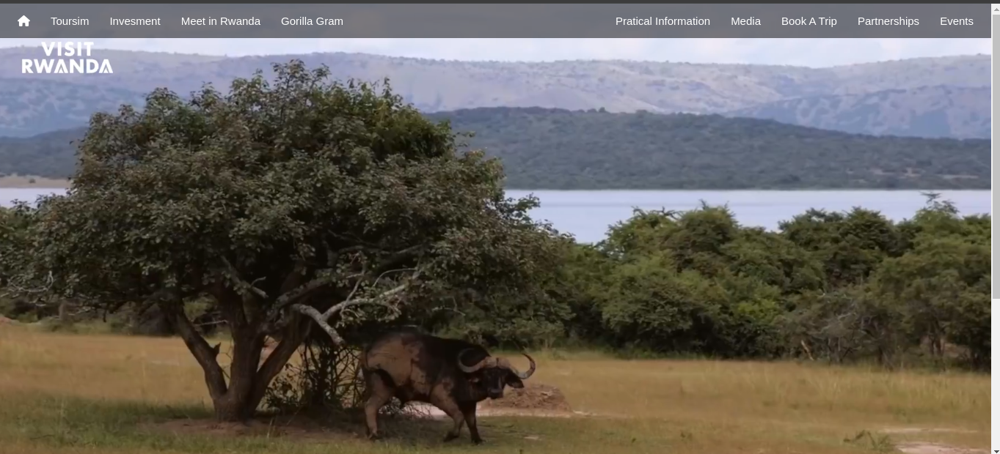
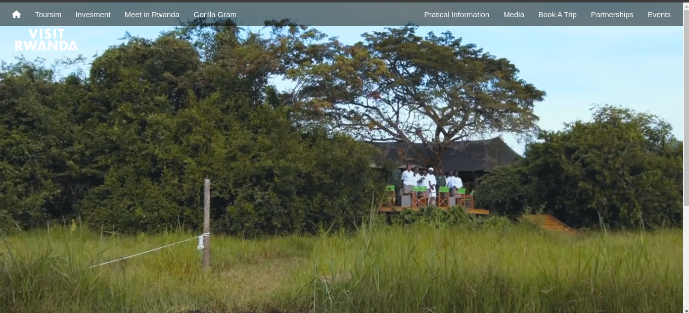

# Visit Rwanda Clone With HTML and **CSS**
This project demonstrates a Clone of Visit Rwanda Website done with Pure HTML and CSS, JS this repository is for educational Puropose and people who are interested in frontend development and its easy to understand the codes used.

## Author
**Loue Sauveur Christian**
## Screen Shots of Output

**Landing Page View One**

**Landing Page View Two**

**Landing Page View Three**

**Landing Page View Four**

## Usage
### Steps
  1. Step One Clone Repository

    git clone https://github.com/lscblack/vist_rwanda_clone_with_html_css.git
   
2. Step Two

    open vist_rwanda_clone_with_html_css Folder in your downloads folder

3. Step Three

    open index.html in your browser

## License
    [MIT License](LICENSE)

Feel Free to create Folks and dont hesitate to reach if encount an issue or idea.
### Contact Me
    Email: l.christian@alustudent.com 
    Phone: +250790110231
## Happy Hacking !!
