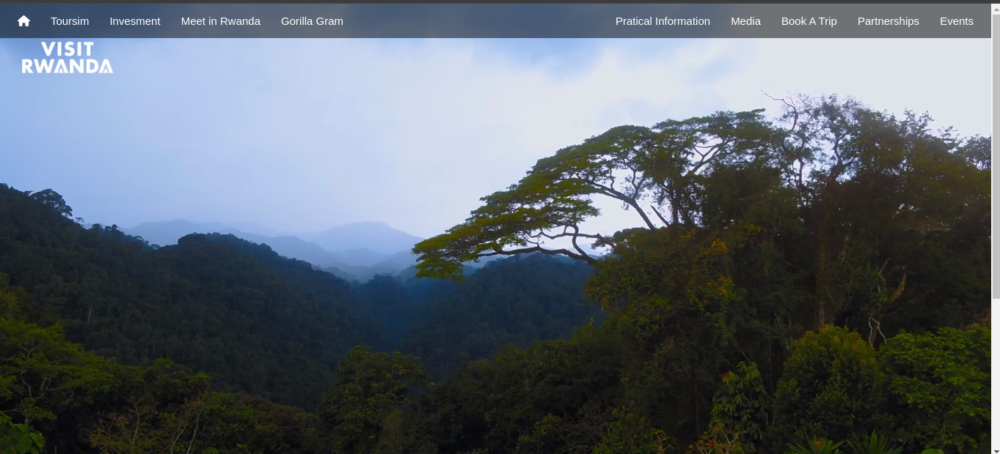

# Visit Rwanda Clone With HTML and **CSS**
This project demonstrates a Clone of Visit Rwanda Website done with Pure HTML and CSS, JS this repository is for educational Puropose and people who are interested in frontend development and its easy to understand the codes used.

## Author
**Loue Sauveur Christian**
## Screen Shots of Output

**Landing Page View One**

**Landing Page View Two**

**Landing Page View Three**

**Landing Page View Four**

## Usage
### Steps
  1. Clone Repository

    git clone https://github.com/lscblack/vist_rwanda_clone_with_html_css.git
   
